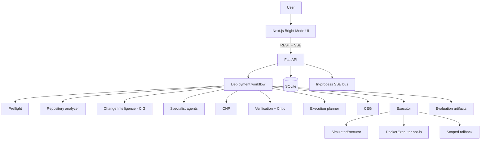
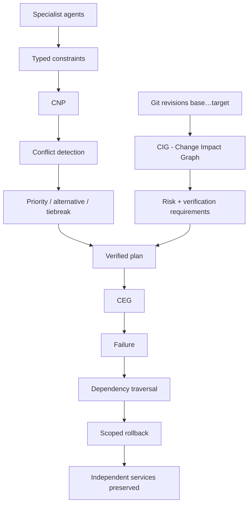

# ARCHITECTURE.md — MEDHA V1

Status: **IMPLEMENTED** through Phases 0–12 (prototype). Runtime is a single FastAPI process + in-process workflow (not a separate microservice mesh).

---

## 1. Purpose

Define the system shape for MEDHA V1 so implementation and viva explanations stay consistent.

---

## 2. Design Principles

1. Single Next.js frontend + single FastAPI backend process.
2. Logical agents as Python callables — **not** separate services or workers.
3. Deterministic paths first; LLM only for bounded mediation (optional; unused by default).
4. SQLite persistence; in-process event bus + SSE.
5. Local Docker host as the only optional mutate target.
6. Demo Mode exercises the same pipeline *shape* without external deps.
7. CNP and CEG are first-class research components.
8. **CIG (Change Impact Graph)** — Phase 12/2 — is a third research component:
   deterministic repository-dependency impact from git revisions, formally
   **distinct from the CEG** (runtime execution causality).

> **Note:** Early docs mentioned LangGraph. The V1 implementation uses an in-process `PlanningPipeline` / demo runner. Do not claim a LangGraph runtime unless it is added later with an ADR.

---

## 3. System Diagram



ASCII (same story):

```
User → Next.js UI → FastAPI → Workflow
         │              │
         │              ├─ SQLite
         │              └─ SSE events
         └─ panels consume SSE snapshots
```

---

## 4. Research Contribution Diagram



---

## 5. Logical Agents (in-process)

Preflight · Analyzer · Docker · Nginx · Security · Mediator/CNP · Verifier · Critic · Executor · Rollback

---

## 6. Data & Events

- Deployments + events in SQLite (`DATA_MODEL.md`, `API_CONTRACT.md`).
- SSE streams stage/status/metadata for UI (no fake chain-of-thought).

---

## 7. Execution modes

| Mode | Path |
|------|------|
| Demo | `DemoRunner` fixtures |
| Real + simulator | Default `choose_executor` path |
| Real + Docker | `MEDHA_DOCKER_EXECUTE=true` |

---

## 8. Out of scope (architecture)

No Redis, PostgreSQL, Kafka, Celery, Kubernetes, cloud, SSH, DNS, CI/CD, multi-host.
