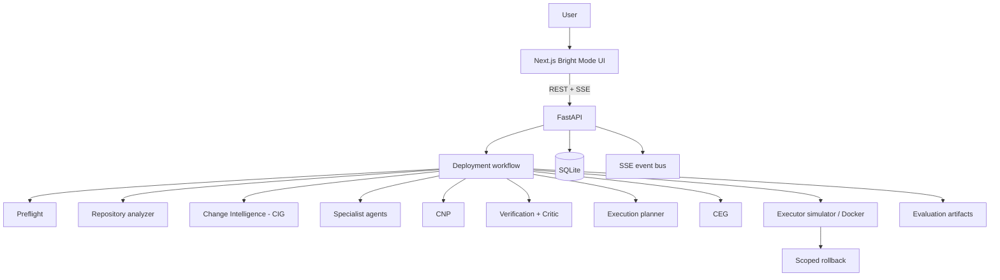

# MEDHA

**Constraint-Negotiating Multi-Agent Architecture for Verifiable DevOps Automation**

A college major-project **prototype** for constraint-aware, verifiable DevOps automation on a local laptop.

> MEDHA is **not** production-ready DevOps, not fully autonomous operations, and not a claim of scientific superiority over existing systems. It is a demonstrable research prototype with measured results on project-defined datasets.

---

## 1. Overview

MEDHA accepts a repository URL and operator intent, analyzes deployment manifests, lets specialist logical agents publish **typed constraints**, negotiates conflicts via the **Constraint Negotiation Protocol (CNP)**, **verifies** the plan before any host mutation, executes locally (simulator by default; optional Docker), records actions in a **Causal Execution Graph (CEG)**, and on failure performs **scoped rollback** that preserves independent successful services. **Demo Mode** provides deterministic offline demos; **Real Mode** runs the same pipeline shape against local analysis/execution.

---

## 2. Problem statement

Multi-agent and LLM-assisted DevOps tools often:

- collide on ports, environment, mounts, and security without an explicit negotiation protocol;
- execute opaque plans without a hard verification gate;
- roll back too broadly (or not at all) when one service fails;
- depend on cloud-heavy stacks that are hard to demo or evaluate on a low-end laptop.

---

## 3. Motivation

Infrastructure decisions (ports, privileges, dependency order) must be **reproducible and explainable**. MEDHA keeps research-critical mechanisms **deterministic** and treats optional LLM mediation as a bounded escape hatch—not the default brain for every decision.

---

## 4. Core contributions

### Constraint Negotiation Protocol (CNP)

Specialist agents publish typed constraints (`PORT_CLAIM`, `ENV_VAR`, `VOLUME_MOUNT`, `NETWORK_POLICY`, `SECURITY_POLICY`, `EXEC_ORDER`). Conflicts are detected by resource key and resolved by priority:

`SECURITY > RESOURCE > DEPENDENCY > PREFERENCE`

Then: alternatives → deterministic tiebreak (LLM optional for same-priority ambiguity). Max **3** rounds.

### Causal Execution Graph (CEG)

Each meaningful action is a node with parents/dependents and status. On failure, MEDHA rolls back **downstream dependents** in reverse dependency order and **preserves** ancestors and independent branches.

### Change Impact Graph (CIG)

Phase 12/2 — before executing anything, MEDHA runs deterministic **change intelligence** over local git revisions (`base → target`): a ChangeSet becomes file/symbol diffs, dependency edges with concrete `file:line` evidence and confidence, an impact traversal, a composite **risk**, and **verification requirements** mapped to the existing verifier. Unresolved or deleted imports are reported as evidence — never invented. No LLM is used. **CIG ≠ CEG**: CIG is repository dependency impact; CEG is runtime execution causality.

---

## 5. System architecture



Logical agents are **in-process** Python callables (not microservices). Persistence is **SQLite**. Events are **SSE**.

---

## 6. Main workflow

```
Repository → Preflight → Analysis → Change Intelligence (CIG) → Specialist Agents → CNP
  → Verification → Critic → Replan (≤3) → Execution Plan → CEG
  → Execution → Failure? → Scoped Rollback → Result → Evaluation
```

**Principle:** never execute an unverified plan.

---

## 7. Technology stack

| Layer | Choice |
|-------|--------|
| Frontend | Next.js, React, TypeScript, Tailwind, `@xyflow/react` |
| Backend | Python, FastAPI, Uvicorn, Pydantic v2, PyYAML, pytest |
| Data | SQLite |
| Events | REST + SSE |
| Execution | Simulator (default) / local Docker CLI (opt-in) |

**₹0 mandatory cost** — no paid cloud/LLM required for Demo Mode or core research paths.

---

## 8. Demo Mode vs Real Mode

| | **Demo Mode** | **Real Mode** |
|--|---------------|---------------|
| Needs | None (offline fixtures) | Local path or git; Docker only if mutate enabled |
| Label | `DEMO/MOCK` / DEMO MODE | REAL DEPLOYMENT |
| Execution | Deterministic scenario runner | Planning pipeline + simulator or DockerExecutor |

Never mix demo and real results in the UI narrative.

---

## 9–12. Verification, Critic, Scoped rollback, Evaluation

- **Verification** — schema, YAML/compose, security rules, consistency; blocks execution on failure (`VERIFICATION_SPEC.md`).
- **Critic** — deterministic 0–100 scores; `PASS` / `REPLAN` / `ESCALATE` (prototype scores, not scientific metrics).
- **Scoped rollback** — CEG downstream only; independent successes preserved (`CEG_SPEC.md`).
- **Evaluation** — project-defined CNP/CEG runners + `GLOBAL_ROLLBACK` baseline (`EVALUATION.md`, `/evaluation`).

---

## 13. Implemented / Measured / Not supported

### Implemented
Deterministic CNP · shallow repo analysis · specialist agents · verification + critic · bounded replan · CEG · simulator execution · opt-in local Docker mutate · scoped rollback · Demo Mode (5 scenarios) · evaluation runners · Bright Mode UI + SSE · **Change Intelligence (CIG)**: local-git diff → evidence-labelled impact graph, risk, verification requirements (Phase 12/2)

### Measured (from actual runners — re-run to refresh)
See `EVALUATION.md` and `backend/data/evaluation/*_latest.json`. Typical recent local run: CNP **8/8**, CEG **5/5**, pytest **75 passed / 2 skipped** (Docker), frontend **28 tests** + `tsc`/`lint`/`build` green.

### Not supported
Kubernetes · cloud · SSH · multi-host · DNS · CI/CD · Terraform · Redis · PostgreSQL · Kafka · Celery · arbitrary auto-deploy of any GitHub app · **remote-git change intelligence** (Phase 12/2 is local git only)

---

## 14. Known limitations

- Real Docker mutation is **opt-in** (`MEDHA_DOCKER_EXECUTE=false` by default).
- Docker E2E may be **skipped** when Docker is unavailable — do not claim it passed without running it.
- Prefer controlled fixtures / manifests; unsupported repos fail closed (`DEPLOYMENT_UNSUPPORTED`).
- One real deployment at a time (`DEPLOYMENT_BUSY`).
- LLM is optional; deterministic fallback always available.
- Demo Mode is simulated (labelled).
- Evaluation metrics are **project-defined** prototype measures.
- No multi-host or cloud deployment.
- Change Intelligence analyses **local git repositories only** (remote URLs
  → `NOT_LOCAL_REPOSITORY`); static analysis, repo code never executed.

---

## 15. Installation & run

**Prerequisites:** Python 3.11+, Node.js 18+, Git. Docker optional.

```powershell
# Backend
cd backend
python -m venv .venv
.\.venv\Scripts\activate
pip install -r requirements.txt
copy ..\.env.example ..\.env   # optional
uvicorn app.main:app --reload --host 127.0.0.1 --port 8000

# Frontend (new terminal)
cd frontend
npm install
npm run dev
```

Open `http://localhost:3000` → select **Demo Mode** → scenario → **Start Deployment**.

### Tests & evaluation

```powershell
cd backend
.\.venv\Scripts\python.exe -m pytest tests -q
.\.venv\Scripts\python.exe -m app.evaluation.run_all

cd ..\frontend
npx tsc --noEmit
npm run lint
npm run build
```

Optional Docker E2E:

```powershell
$env:MEDHA_DOCKER_EXECUTE="true"
.\.venv\Scripts\python.exe -m pytest tests/test_docker_e2e.py -m docker
```

---

## 16. Project structure

```
Medha/
├── README.md, AGENTS.md, ARCHITECTURE.md, PROJECT_SCOPE.md
├── CNP_SPEC.md, CEG_SPEC.md, CIG_SPEC.md, VERIFICATION_SPEC.md, EVALUATION.md
├── DEMO_MODE.md, API_CONTRACT.md, DATA_MODEL.md, DECISIONS.md
├── docs/
│   ├── VIVA_GUIDE.md          # viva Q&A
│   ├── DEMO_SCRIPT.md         # 5–10 min demo
│   └── evaluation/
├── backend/app/               # FastAPI, agents, CNP, execution, evaluation
├── frontend/                  # Bright Mode UI
├── tests/                     # shared notes
└── .env.example
```

---

## 17. Documentation index

| Doc | Purpose |
|-----|---------|
| [ARCHITECTURE.md](ARCHITECTURE.md) | System shape + diagrams |
| [CNP_SPEC.md](CNP_SPEC.md) | Constraint Negotiation Protocol |
| [CEG_SPEC.md](CEG_SPEC.md) | Causal Execution Graph + rollback |
| [CIG_SPEC.md](CIG_SPEC.md) | Change Intelligence (Phase 2): CIG, risk, requirements |
| [VERIFICATION_SPEC.md](VERIFICATION_SPEC.md) | Verification + critic gate |
| [EVALUATION.md](EVALUATION.md) | Experiments + measured results |
| [DEMO_MODE.md](DEMO_MODE.md) | Offline scenarios |
| [docs/VIVA_GUIDE.md](docs/VIVA_GUIDE.md) | Viva answers |
| [docs/DEMO_SCRIPT.md](docs/DEMO_SCRIPT.md) | Presentation script |
| [docs/VALIDATION_CHECKLIST.md](docs/VALIDATION_CHECKLIST.md) | Pre-viva checklist |
| [DECISIONS.md](DECISIONS.md) | ADRs |

---

## 18. Academic disclaimer

MEDHA is a **prototype architecture** for constraint-aware, verifiable DevOps automation. Evaluation results apply to the **seeded datasets and fixtures tested**. They do not prove universal optimality, production readiness, or superiority over commercial platforms.

---

## Phase status

| Phase | Status |
|------:|--------|
| 0–11 | **TESTED** / IMPLEMENTED as documented |
| 12 | **TESTED** — polish, docs, viva packaging |
| 12/2 | **TESTED** — Change Intelligence (CIG) + fixtures + API + UI + report |

**Current:** Phases 0–12 + Phase 12/2 complete for the V1 college prototype scope.
