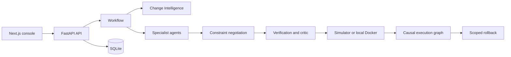

# MEDHA

**Constraint-Negotiating Multi-Agent Architecture for Verifiable DevOps Automation**

MEDHA is a local-first research prototype for planning, verifying, executing, and explaining multi-agent DevOps workflows. It uses typed constraints, bounded negotiation, deterministic verification, a causal execution graph, and dependency-aware rollback.

> MEDHA is an academic prototype, not a production deployment platform. It does not provide cloud, multi-host, Kubernetes, CI/CD, SSH, or arbitrary repository deployment.

## Contents

- [Why MEDHA](#why-medha)
- [How it works](#how-it-works)
- [Features](#features)
- [Requirements](#requirements)
- [Quick start](#quick-start)
- [Configuration](#configuration)
- [Testing](#testing)
- [Repository layout](#repository-layout)
- [Documentation](#documentation)
- [Scope and limitations](#scope-and-limitations)
- [Contributing](#contributing)
- [Security](#security)
- [License](#license)

## Why MEDHA

Infrastructure agents can produce conflicting decisions about ports, mounts, security, environment variables, and execution order. MEDHA makes those decisions observable and verifiable before execution:

1. Analyze a local repository and deployment intent.
2. Collect typed constraints from specialist agents.
3. Resolve conflicts with the Constraint Negotiation Protocol (CNP).
4. Verify and critique the plan before any host mutation.
5. Execute with a simulator by default, or opt into local Docker.
6. Record actions in a Causal Execution Graph (CEG).
7. Roll back only failed downstream dependents while preserving independent successes.

Change Intelligence (CIG) can additionally inspect local Git revisions and produce evidence-backed impact, risk, and verification requirements without executing repository code.

## How it works



The backend is one FastAPI process. Logical agents are in-process Python components; MEDHA does not require Redis, PostgreSQL, Kubernetes, or a fleet of worker services.

## Features

- Deterministic CNP with typed constraints, priority resolution, alternatives, and a maximum of three rounds.
- Verification and critic gates that block unverified execution.
- Simulator-first execution with opt-in local Docker mutation.
- CEG action history and dependency-aware rollback.
- CIG analysis for local Git repositories with file and symbol evidence.
- Demo Mode with deterministic offline scenarios labelled `DEMO/MOCK`.
- FastAPI REST endpoints and Server-Sent Events for observable workflow state.
- SQLite persistence with no mandatory cloud services or API keys.
- Offline evaluation runners for CNP and CEG comparisons.

## Requirements

- Python 3.11 or newer
- Node.js 18 or newer and npm
- Git
- Docker Desktop, only for optional Docker execution and E2E tests

## Quick start

From the repository root:

```powershell
Copy-Item .env.example .env

cd backend
python -m venv .venv
.\.venv\Scripts\Activate.ps1
pip install -r requirements.txt
uvicorn app.main:app --reload --host 127.0.0.1 --port 8000
```

In a second terminal:

```powershell
cd frontend
npm install
npm run dev
```

Open [http://localhost:3000](http://localhost:3000), choose **Demo Mode**, select a scenario, and start a deployment. The API is available at [http://127.0.0.1:8000](http://127.0.0.1:8000); its health endpoint is `/health`.

## Configuration

`.env.example` is the canonical template. Copy it to `.env`; do not commit local environment files. The default configuration is intentionally safe for demonstrations:

| Variable | Default | Purpose |
| --- | --- | --- |
| `MEDHA_DATABASE_PATH` | `./data/medha.db` | SQLite database location |
| `MEDHA_EXECUTOR_MODE` | `auto` | `auto`, `simulator`, or `docker` |
| `MEDHA_DOCKER_EXECUTE` | `false` | Allow local Docker mutation |
| `MEDHA_DOCKER_CLEANUP` | `true` | Clean up Docker resources |
| `MEDHA_MAX_VERIFY_ROUNDS` | `3` | Maximum verification/replan rounds |
| `MEDHA_CORS_ORIGINS` | `http://localhost:3000` | Allowed frontend origin |
| `NEXT_PUBLIC_API_BASE_URL` | `http://127.0.0.1:8000` | Frontend API URL |
| `NEXT_PUBLIC_DEMO_MODE_DEFAULT` | `true` | Initial frontend mode |

Optional LLM mediation is disabled by default and is not required for the core workflow. Never put real keys in `.env.example`, source files, issues, logs, or prompts.

## Testing

Backend tests:

```powershell
cd backend
\.venv\Scripts\python.exe -m pytest -q
```

Frontend checks:

```powershell
cd frontend
npm test
npm run lint
npm run build
```

Evaluation runners can be started from `backend`:

```powershell
\.venv\Scripts\python.exe -m app.evaluation.run_all
```

Docker tests are optional and require a running Docker daemon:

```powershell
$env:MEDHA_DOCKER_EXECUTE = "true"
\.venv\Scripts\python.exe -m pytest tests/test_docker_e2e.py -m docker -q
```

## Repository layout

```text
backend/        FastAPI service, agents, workflow, persistence, and tests
frontend/       Next.js dashboard and UI tests
docs/           Demo, validation, evaluation, and viva material
*.md            Architecture, protocol, data, API, and scope specifications
.env.example    Safe local configuration template
```

## Documentation

| Document | Description |
| --- | --- |
| [ARCHITECTURE.md](ARCHITECTURE.md) | System architecture and boundaries |
| [CNP_SPEC.md](CNP_SPEC.md) | Constraint Negotiation Protocol |
| [CEG_SPEC.md](CEG_SPEC.md) | Causal graph and rollback semantics |
| [CIG_SPEC.md](CIG_SPEC.md) | Change Intelligence design |
| [VERIFICATION_SPEC.md](VERIFICATION_SPEC.md) | Verification and critic rules |
| [API_CONTRACT.md](API_CONTRACT.md) | REST and SSE contracts |
| [DATA_MODEL.md](DATA_MODEL.md) | Persisted data model |
| [EVALUATION.md](EVALUATION.md) | Evaluation methodology and results |
| [DEMO_MODE.md](DEMO_MODE.md) | Offline demo scenarios |
| [docs/DEMO_SCRIPT.md](docs/DEMO_SCRIPT.md) | Demonstration walkthrough |
| [docs/VIVA_GUIDE.md](docs/VIVA_GUIDE.md) | Project presentation guide |
| [DECISIONS.md](DECISIONS.md) | Architecture decision records |

## Scope and limitations

MEDHA supports local targets and one real deployment at a time. Docker mutation is opt-in. Demo results are simulated and labelled. CIG accepts local Git repositories only; remote URLs are rejected. The project intentionally excludes cloud deployment, multi-host orchestration, Kubernetes, DNS automation, CI/CD automation, SSH, Redis, PostgreSQL, Kafka, Celery, and Terraform.

Evaluation values are project-defined prototype measurements on seeded fixtures. They are not evidence of universal optimality, production readiness, or superiority over existing platforms.

## Contributing

Contributions should preserve the project principles in [AGENTS.md](AGENTS.md): working over clever, deterministic over unnecessary LLM calls, local over cloud, and demonstrable over theoretically complete.

Before opening a pull request:

1. Keep changes within the documented project scope.
2. Add or update focused tests for behavioral changes.
3. Run the relevant backend and frontend checks.
4. Update the affected specification or documentation.
5. Do not include `.env`, database files, credentials, or generated runtime data.

For larger changes, explain the design and tradeoffs in an issue or architecture decision record first.

## Security

Do not commit secrets. If a credential is exposed, revoke and rotate it immediately, then remove it from the working tree and history as appropriate. Security reports should not be posted publicly with exploit details; contact the repository maintainer privately and include reproduction steps, affected versions, and impact.

## License

No license has been selected for this repository yet. Until a license is added, the code should be treated as **all rights reserved** and should not be redistributed or used as an open-source dependency.